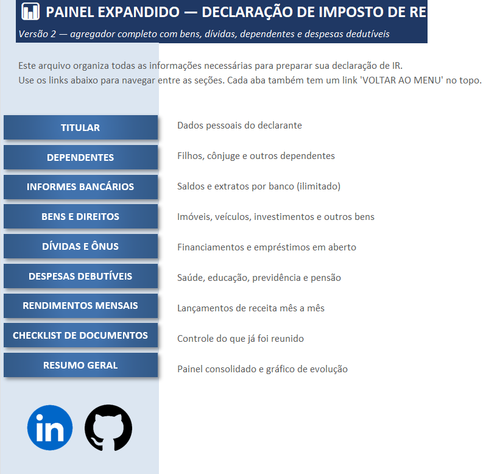
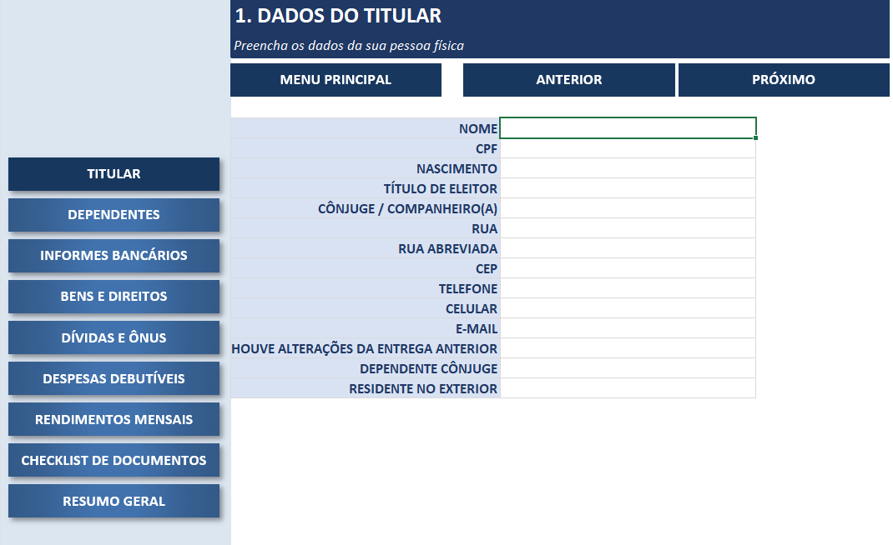
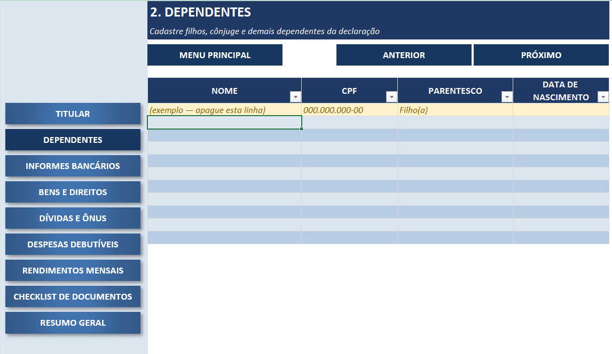
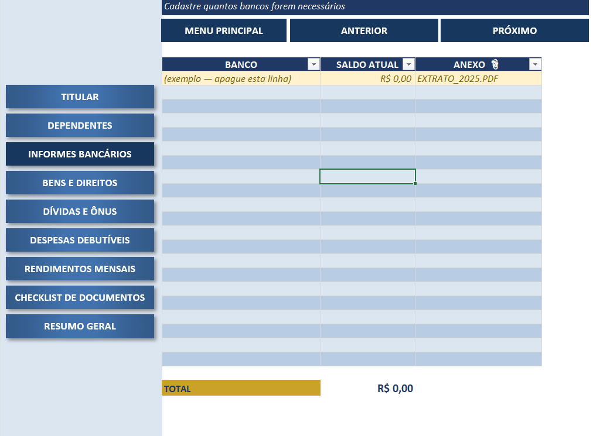
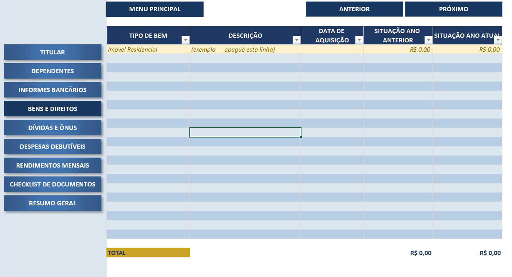
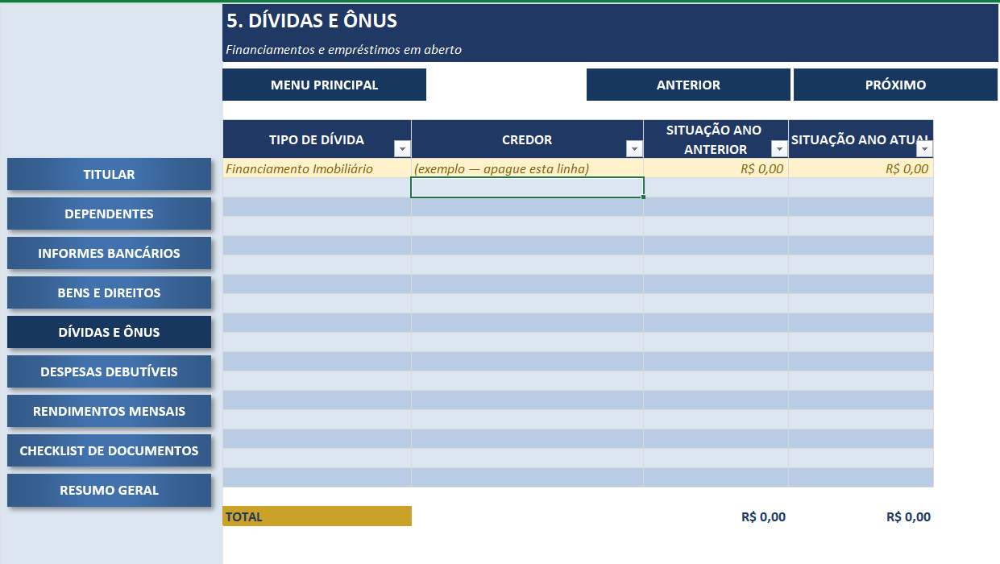
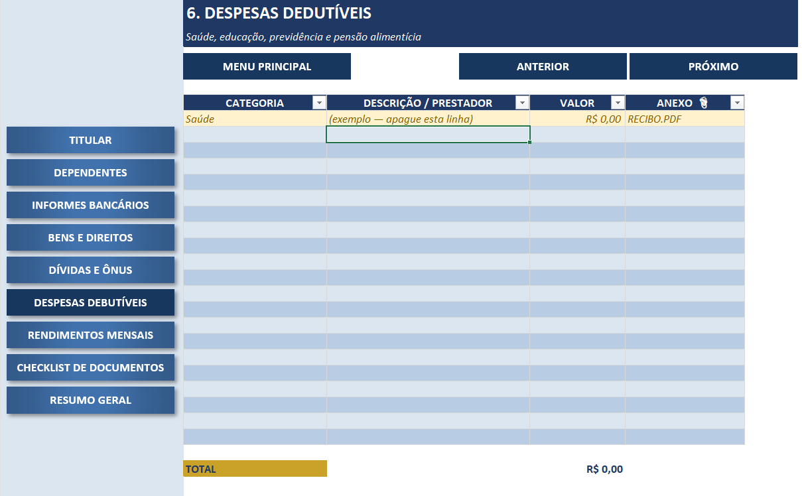
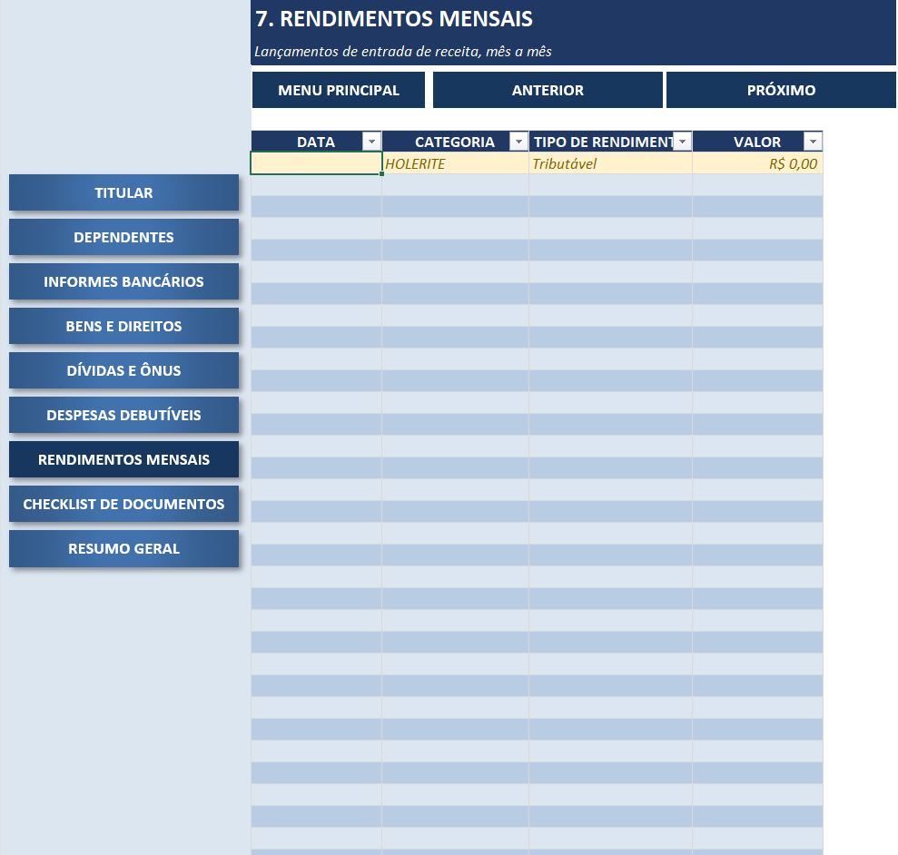
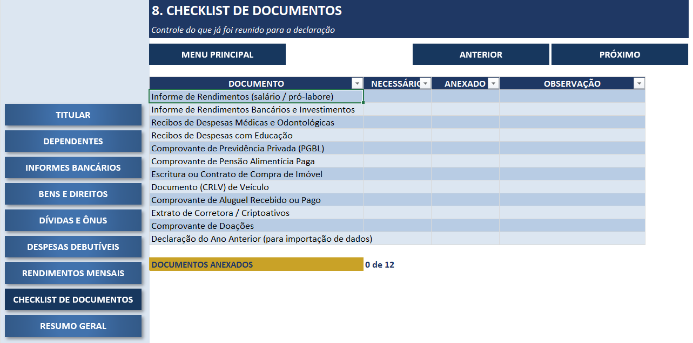
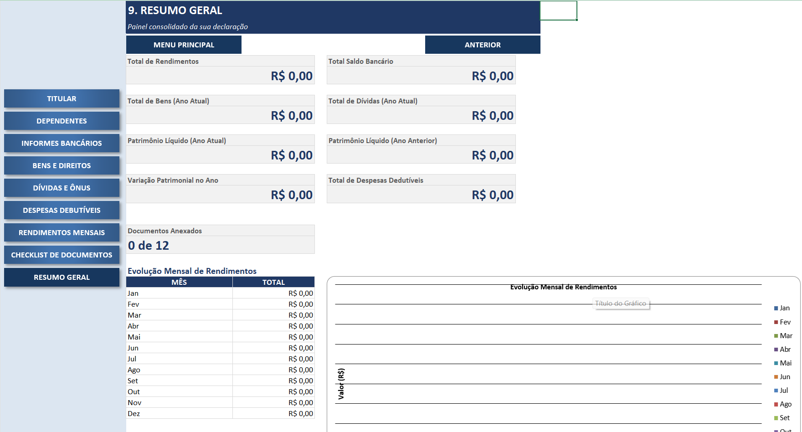

# 🦁 LION CONTROL SYSTEM — Agregador de Dados para Declaração de Imposto de Renda

Projeto desenvolvido como parte do desafio de laboratório da **DIO (Digital Innovation One)**, com o objetivo de aplicar em um ambiente prático os conceitos de Excel abordados na trilha, construindo uma ferramenta robusta e ao mesmo tempo amigável para uso real.

## 📖 Sobre o Projeto

Reunir os documentos e informações necessárias para a declaração de Imposto de Renda costuma ser um processo espalhado entre extratos bancários, holerites, notas e anotações soltas. Este projeto propõe um **agregador de dados construído inteiramente no Excel**, que centraliza essas informações em um único arquivo, com navegação guiada, validação automática de dados e uma interface visual própria.

O repositório documenta duas etapas do processo:

- **`PLANILHA_DE_ESTUDOS...xlsx`** — a ferramenta-base construída acompanhando as vídeo-aulas, com as três abas originais (TITULAR, INFORMES, NOTAS) e o menu de navegação inicial;
- **`APP_IMPOSTO_DE_RENDA_versão_final.xlsx`** — a **versão final entregue**, expandida a partir da base das aulas com seções adicionais (Dependentes, Bens e Direitos, Dívidas e Ônus, Despesas Dedutíveis), navegação completa entre abas e um painel de resumo consolidado.

> ⚠️ **Nota sobre os dados:** a planilha é entregue como um **template em branco**, pronto para uso — nenhum dado pessoal real está preenchido.

## 🎯 Objetivos de Aprendizagem

- Aplicar os conceitos aprendidos em um ambiente prático;
- Documentar processos técnicos de forma clara e estruturada;
- Utilizar o GitHub como ferramenta para compartilhamento de documentação técnica.

## 🧩 Estrutura da Ferramenta (Versão Final)

A versão final é dividida em 9 abas de uso, mais uma aba oculta de apoio:

| Aba | Conteúdo |
|---|---|
| **MENU** | Página inicial com índice e links diretos para cada seção |
| **TITULAR** | Dados pessoais do declarante, com validação de formato (CPF, CEP, e-mail) |
| **DEPENDENTES** | Cadastro de dependentes (filhos, cônjuge, etc.) — nome, CPF, parentesco e nascimento |
| **INFORMES** | Bancos e saldos, em tabela dinâmica sem limite de linhas, com total consolidado |
| **BENS** | Bens e direitos (imóveis, veículos, investimentos), comparando ano anterior x atual |
| **DIVIDAS** | Dívidas e ônus (financiamentos, empréstimos), com a mesma comparação de períodos |
| **DESPESAS** | Despesas dedutíveis (saúde, educação, previdência, pensão), somadas automaticamente |
| **RENDIMENTOS** | Lançamentos de rendimento mês a mês, classificados por categoria e tipo tributário |
| **CHECKLIST** | Lista dos documentos típicos exigidos, com contador de progresso |
| **RESUMO** | Painel consolidado com 8 indicadores-chave e gráfico da evolução mensal de rendimentos |
| **TABELAS** *(oculta)* | Base de apoio com todas as listas usadas nas validações suspensas (bancos, tipos de bem, tipos de dívida, etc.) |

## 🖱️ Navegação

Cada aba (a partir da segunda) conta com três atalhos fixos no topo, permitindo navegar de qualquer forma pelo fluxo:

- **⬅ VOLTAR AO MENU** — retorna direto à página inicial;
- **◀ ANTERIOR** — volta para a aba anterior da sequência;
- **PRÓXIMO ▶** — avança para a próxima aba (ausente apenas na última aba, RESUMO).

## 🧮 Fórmulas, Validações e Conceitos Aplicados

- **Tabelas estruturadas do Excel** em todas as seções de lançamento (Dependentes, Informes, Bens, Dívidas, Despesas, Rendimentos, Checklist), com autofiltro e referências estruturadas nas fórmulas (`=SUM(TabelaBens[SITUAÇÃO ANO ATUAL])`);
- **`SUM`** — consolida totais de saldo bancário, bens, dívidas e despesas;
- **`SUMPRODUCT` + `MONTH`** — agrega os rendimentos por mês para alimentar o gráfico de evolução;
- **`COUNTIF` / `COUNTA`** — calcula o progresso do checklist de documentos;
- **Gráfico nativo do Excel** (colunas), gerado a partir da agregação mensal de rendimentos;
- **Validação de Dados (listas suspensas)** para bancos, parentesco, tipo de bem, tipo de dívida, categoria de despesa, tipo de rendimento e respostas SIM/NÃO;
- **Validação customizada por fórmula** para formato de CPF, CEP e e-mail, com mensagens de erro e de ajuda personalizadas;
- **Aba oculta como base de dados**, separando as listas de apoio da interface de uso;
- **Hyperlinks internos**, formando o sistema de navegação entre abas.

## ▶️ Como Usar

1. Baixe o arquivo `APP_IMPOSTO_DE_RENDA_versão_final.xlsx` deste repositório;
2. Abra no Excel (recomendado, por conta dos recursos de validação avançada) ou no LibreOffice Calc;
3. Comece pela aba **MENU** e navegue pelas seções na ordem sugerida, usando os botões **PRÓXIMO ▶** / **◀ ANTERIOR**;
4. Em cada tabela, apague a linha de exemplo (marcada em amarelo) antes de preencher seus próprios dados;
5. Ao final, confira o painel **RESUMO** para visualizar o total de rendimentos, patrimônio líquido e o gráfico de evolução mensal.

## 📂 Estrutura do Repositório

```
├── APP_IMPOSTO_DE_RENDA_versão_final.xlsx   # Ferramenta completa — entrega final
├── PLANILHA_DE_ESTUDOS...xlsx               # Versão-base construída durante as aulas
├── images/                                  # Capturas de tela de cada aba da ferramenta
└── README.md                                # Este documento
```

## 🖼️ Capturas de Tela





















## 📚 Principais Aprendizados

- Como evoluir uma ferramenta a partir de uma base construída em aula, identificando lacunas reais (dependentes, bens, dívidas, despesas) e transformando-as em novas seções funcionais;
- Uso de **tabelas estruturadas** para eliminar limites artificiais (como o antigo limite de 4 bancos) e tornar a planilha escalável;
- Construção de um **painel de resumo** que consolida múltiplas tabelas com fórmulas de agregação;
- Criação de **gráficos nativos do Excel** a partir de dados agregados por fórmula;
- Projeto de uma **experiência de navegação** consistente (menu + anterior/próximo) dentro do próprio Excel;
- Importância de documentar tecnicamente um projeto — e de revisar dados sensíveis antes de publicar um material publicamente.

## 🛠️ Tecnologias e Ferramentas

- Microsoft Excel
- Git & GitHub

## 👤 Autor

Desenvolvido por **Felipe Silva Fernandes** como parte da trilha de estudos da [DIO](https://www.dio.me/).

---
<sub>Projeto de laboratório — Bootcamp DIO</sub>
